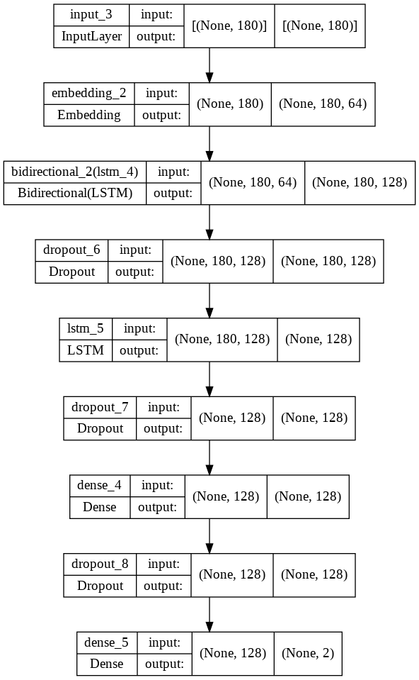

# Sentiment-Analysis
 Trained with over 60,000 dataset to categorize positive and negative reviews

# Step by step
1) To launch the app, clone the project and execute it
2) Key your information

*Hello World*
**Hello World**

This is so funny! :joy:

## This is to insert code in readme
` print('hello') `
` print('hi my name is khai') `

## To include url link

')
[url_to_cheat_sheet](https://rahuldkjain.github.io/gh-profile-readme-generator/)

## To include images

